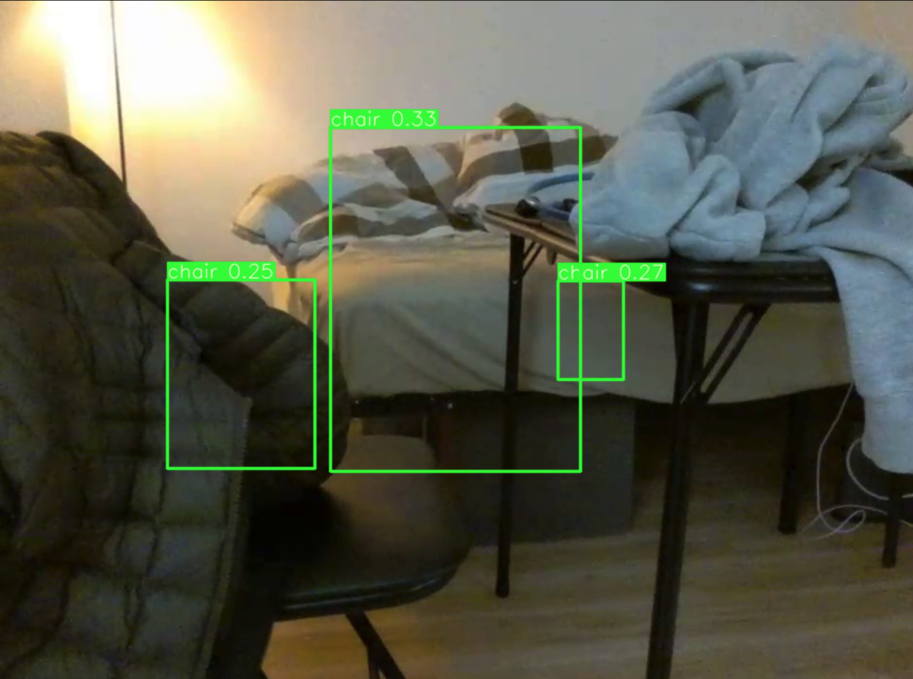

# Drone Surveillance System with Speech recognition, Object & Gesture Detection
This script allows you to trigger different functions of a drone using command-line arguments. You can use this script to control the drone's behavior based on voice commands, gestures, or object detection. This project aims to create an interactive and versatile system for controlling a DJI Tello drone, offering users multiple input methods for a more engaging and user-friendly experience while ensuring safety and ease of use.

# Demonstration
Figure left: Gesture Detection; Figure right: Object Detection
<div style="display: flex;">
  
  
</div>

## Prerequisites
1. Clone or download this repository to your local machine.
```
git clone https://github.com/ChenFengTsai/Drone_Demo.git
```

2. Install the required Python packages using pip:
```
pip install -r requirements.txt
```

## Usage
To use the script, follow the steps below:

1. Connect to the drone's Wi-Fi network.

2. Open a terminal or command prompt and navigate to the root directory of the cloned repository.

3. Navigate to the `demo` folder and run the main.py script with the desired function argument:
```
python3 main.py --func [function]
```
Replace `[function]` with one of the following options:
* `gesture` - Trigger gesture detection function with MediaPipe.
* `object` - Trigger object detection function with YOLOv5.

4. The drone will at first trigger voice detection to takeoff, and then conduct the operation you specified.

Voice commands:
* `apple` - Takeoff
* `chicken` - Land

5. Follow the prompts or instructions displayed on the screen to interact with the drone based on the chosen function.

## Configuration
The script uses a configuration file (config.ini) to specify the IP address of the drone's Wi-Fi network. You can modify the IP address in the config.ini file to match your drone's IP address.

## License
This project is licensed under the GNU General Public License v3.0 (GPL-3.0). The full text of the license can be found in the [LICENSE](LICENSE) file.

## Disclaimer
* Use the script responsibly and in compliance with local laws and regulations.
* Be cautious when operating a drone to ensure safety.
* The script is provided as-is, without any warranty.
